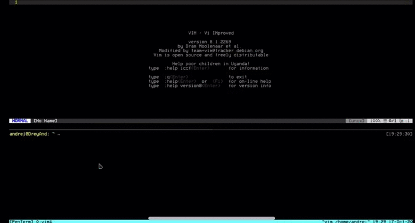
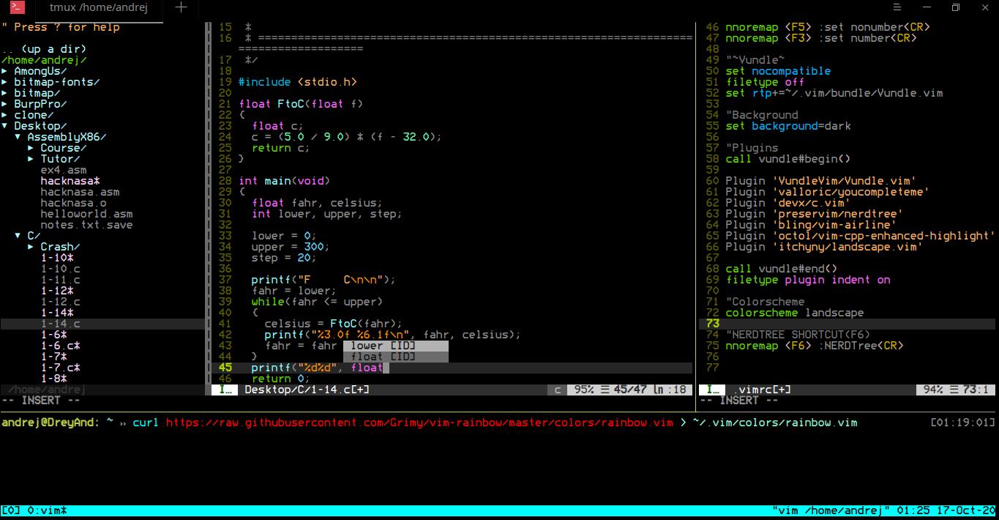

# PenTerm 
My terminal config used for penetration testing and to gain more work speed, beauty and efficiency!

It consits of combination between:
	1. Vim
	2. Tmux
	3. Fish shell
	4. Bedstead font (nerd font version of ~~banned~~ bitmap fonts)




# SETUP

## 1. VIM:

Take the given .vimrc file and use the following instructions:

```
1. $ git clone https://github.com/VundleVim/Vundle.vim.git ~/.vim/bundle/Vundle.vim
2. $ apt install build-essential cmake vim python3-dev
3. $ cd ~/.vim/bundle/youcompleteme
4. $ git submodule update --init --recursive
5. $ ./install.sh --all ( or only for C - ./install.sh --clang-completer)
6. :source %
7. :PluginInstall
```

If you get any errors while installing the YCM plugin i **suggest following their official docs**:
https://github.com/ycm-core/YouCompleteMe

This should be able to allow all plugins to work and use of autocomplete/autosuggestion.

`NOTE: This config is mainly C/C++ related , but is easy to work around for any language`

### Useful keybinds:

To get more familliar with the config i suggest reading it (it's very small i promise) but here are some keybinds i have remapped:
`F5` -> hide line number.
`F3` -> show line number.

These 2 are useful for scrolling down the code and copying and pasting using your mouse without entering the visual block mode.

`za` -> code folding.
`F6` -> Nerd Tree (show other directories and files).


## 2. TMUX:

This is just a minimalistic config. Allows you to scroll easly and even change panes using your mouse. Otherwise it's all default keybinds.
Mouse scrolling had a lot of problems trough the tmux history but i think this is the best possible setup for it without getting errors.

### SETUP:

```
1. $ cd ~/ ; git clone https://github.com/nhdaly/tmux-better-mouse-mode
2. $ curl https://raw.githubusercontent.com/DreyAnd/PenTerm/master/Tmux/.tmux.conf > ~/.tmux.conf
3. $ tmux source-file ~/.tmux.conf 
```

`NOTE: To copy text while scrolling (and selecting) hold shift.`

## 3. Fish shell:

Nothing too much about this one. Take a look at the fish_prompt.fish if u want to have the same colors like PenTerm does. 
 
### SETUP:

```
1. $ sudo apt install fish
2. $ curl -L https://get.oh-my.fish > install
3. $ fish install --path=~/.local/share/omf --config=~/.config/omf
4. reload tmux (if you want to do from terminal, do chsh -s /usr/bin/fish)
5. $ omf install godfather
6. $ cp fish_prompt.fish ~/.config/fish/functions/fish_prompt.fish
```

If you wish to not have the autosuggestions run `set fish_color_autosuggestion black` or just place it in your ~/.config/fish/.config.fish .

## 4. Fonts:

It's **bedstead font** which ended up being the closest version to bitmap i like.

## SETUP:
```
1. Download the zip from here: https://bjh21.me.uk/bedstead/
2. Extract it
3. Download font manager
4. Select the file
5. Apply in terminal settings.
```


# That should be it. Enjoy your new ***PenTerm***!


